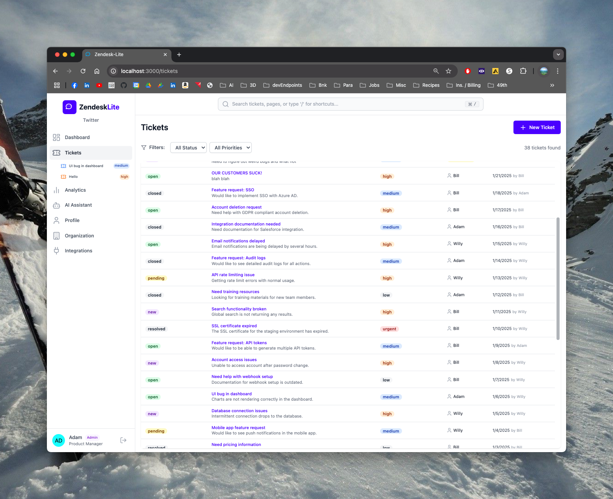

# Zendesk-Lite

A lightweight, modern customer support platform built with React and Vite. This application provides essential helpdesk functionality with a clean, intuitive interface.

## Features

### Ticket Management
- Create, view, and manage support tickets
- Priority levels (low, medium, high, urgent)
- Status tracking (new, open, pending, resolved, closed)
- Rich commenting system with internal notes
- Ticket assignment and reassignment
- Tag-based categorization
- Search and filter capabilities

### User Roles & Permissions
- **Admin**: Full system access, organization management
- **Agent**: Ticket handling and customer support
- **Customer**: Ticket creation and tracking

### Dashboard & Analytics
- Real-time activity tracking
- Ticket statistics and metrics
- Priority distribution charts
- Status breakdown
- Daily ticket trends
- Assignee workload visualization

### Organization Management
- Organization profile customization
- Team member management
- Support email generation and management
- Tag management for ticket categorization
- User invitation system

### Communication
- Internal notes for team collaboration
- Public comments for customer communication
- Email notifications
- Support email integration

## Screenshots

### Organization Settings

Manage organization details, team members, and support email configuration.

### Dashboard

View recent activity, ticket statistics, and important metrics.

### Analytics

Comprehensive analytics with ticket distribution charts and trends.

### Tickets Management

Powerful ticket management interface with filtering and sorting capabilities.

### AI Assistant

Smart AI-powered assistant for quick ticket inquiries and support automation.

### Integrations

Connect with popular third-party services to enhance your support workflow.

## Technical Stack

- **Frontend**: React + Vite
- **Styling**: Tailwind CSS
- **State Management**: React Context
- **Database**: Supabase
- **Authentication**: Built-in auth system

## Getting Started

1. Clone the repository
2. Install dependencies:
```bash
npm install
```

3. Set up environment variables:
```bash
cp .env.example .env
```

4. Start the development server:
```bash
npm run dev
```

## Development

This project uses:
- [@vitejs/plugin-react](https://github.com/vitejs/vite-plugin-react/blob/main/packages/plugin-react/README.md) with Babel for Fast Refresh
- [@vitejs/plugin-react-swc](https://github.com/vitejs/vite-plugin-react-swc) with SWC for Fast Refresh

## Contributing

1. Fork the repository
2. Create your feature branch (`git checkout -b feature/AmazingFeature`)
3. Commit your changes (`git commit -m 'Add some AmazingFeature'`)
4. Push to the branch (`git push origin feature/AmazingFeature`)
5. Open a Pull Request

## License

This project is licensed under the MIT License - see the LICENSE file for details.
